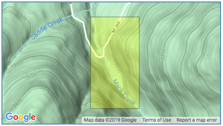

## Introduction

The Pacific Giant Salamander (*Dicamptodon tenebrosus*) is found in mountain streams in the coastal ranges of Southern British Columbia, Oregon and Northern California. While this species is not threatened or endangered, it is particularly sensitive to logging and requires clean water to thrive (Oregon Wild 2019). Since 1993, this species has been monitored as part of the Aquatic Vertebrate Population Study at Mack Creek in the H. J. Andrews Experimental Forest in Oregon. Samples were captured using 2-pass electrofishing, and then measured and weighed. The site is divided into two sections, an area that was clear cut in the early 1960s and an old growth coniferous forest. The creek also has a variety of different channel classifications where aquatic vertebrates were observed, including cascades, pools and side channels (Gregory 2016). This report explores the data collected by Gregory (2016) to compare the counts and weights of salamander populations found in different areas of Mack Creek. 


_**Figure 1.** Pacific Giant Salamander. Credit: [Gary Nafis, www.californiaherps.com](http://www.californiaherps.com/salamanders/images/dtenebrosusfchu3082.jpg)_

## Data and Methods

Data pertaining only to Pacific Giant Salamanders was extracted from the larger dataset from Gregory (2016) for analysis and counts of Pacific Giant Salamanders between old growth and clear cut sections of Mack Creek was explored visually. Next, the counts and proportions of salamanders observed in different channel classifications (pool, cascade, or side-channel) for both old growth and clear cut sections were compared using a Pearson's Chi-squared test to determine whether salamander channel location (pool, cascade or side channel) and section location (old growth or clear cut) were independent of one another. Weights of salamanders from 2017 were visualized and compared using a Welsh Two-Sample T-Test to determine whether a significant difference exists between mean weights for salamanders observed in clear cut versus old growth sections. Finally, the weights of salamanders observed in pools, cascades and side-channels in 2017 were visually compared with a beeswarm plot and a Levene’s test was run to check that variances of the three groupings are equal. This was followed by an analysis of variance (ANOVA) test used to determine if a significant difference exists between salamanders observed at different channel locations. A Tukey’s HSD test was also run post-hoc to determine which channel location pairings differ from each other.


<br/>
_**Figure 2.** Map of research site at Mack Creek. Credit: [Andrews Forest LTER Site, Stanley Gregory](https://portal.edirepository.org/nis/mapbrowse?scope=knb-lter-and&identifier=4027&revision=12)_

## Results

### A. Salamander counts in old growth and clear cut sections of Mack Creek

Pacifc Giant Salamander populations have shown similar trends in both clear cut and old growth sections of Mack Creek, with the counts in old growth sections being slightly higher overall. Both sections show a clear increase in populations around the year 2002 and a sharp decline in populations in 2014, followed by another increase from 2015 to 2017. During this recent population increase, the clear cut section had higher salamander counts than the old growth section.

```{r setup, include=FALSE}
knitr::opts_chunk$set(echo = FALSE)

# apply packages and read in data

library(tidyverse)
library(tidyr)
library(janitor)
library(kableExtra)
library(ggplot2)
library(ggbeeswarm)
library(corrplot)
library(effsize)

raw_verts <- read.csv("mack_creek_vertebrates.csv") %>% 
  clean_names()

```

```{r}

#Results A: Visually compare annual salamander counts in old growth (OG) and clear cut (CC) sections of Mack Creek. For all years when Pacific giant salamander observations were recorded in the study, find the total annual Pacific giant salamander counts for the two sections of Mack Creek. Create a finalized graph to show the changes in annual counts for each section over time, add a figure caption, and briefly describe the trends in text.

# get rid of salmon data

raw_sal <- raw_verts %>% 
  filter(species %in% c("DITE"))

# just get counts for species in OG and CC sections

ct_sal_OG_CC <- raw_sal %>%
  group_by(section, year) %>% 
  count(species)

levels(ct_sal_OG_CC$section) <- c("Clearcut", "Oldgrowth")

#visualize the above

ggplot(ct_sal_OG_CC, aes(x= year, y= n))+
  geom_line(aes(color = section), 
            show.legend = TRUE, 
            size = 0.9) +
  scale_color_discrete(name = "Section", labels = c("Clear Cut", "Old Growth"))+
  labs(x = "Year",
       y = "Number of Salamanders",
       title = "Annual Salamander Counts, Clear Cut vs. Old Growth Sections of Mack Creek") +
  scale_x_continuous(limits = c(1993, 2020), 
                     expand = c(0,0))+
  scale_y_continuous(limits = c(0,400), expand = c(0, 0))+
  theme_light()+
  theme(plot.caption = element_text(hjust = 0, face = "italic"))

# focus just on years w/ Pac Sals; get annual counts

# ct_Pac_sal_OG_CC <- ct_sal_OG_CC %>% 
#   filter(species %in% "DITE")
# 
# # vizualize the above
# 
# ggplot(ct_Pac_sal_OG_CC, aes(x= year, y= n))+
#   geom_point(aes(color = section), show.legend = FALSE)+
#   labs(x = "Year",
#        y = "Number of Salamanders",
#        title = "Annual Pacific Giant Salamander Counts, \nClearcut vs. Oldgrowth Sections of Mack Creek") + theme_light() +
#   scale_y_continuous(limits = c(0,400), expand = c(0, 0))
```

_**Figure 2.** Annual counts of Pacific Giant Salamanders from 1993 - 2017 in clear cut and old growth sections of Mack Creek. The orange line indicates salamander counts in the clear cut section and the blue line indicates salamander counts in the old growth section._

### B. Salamander counts by channel classification in old growth and clear cut sections of Mack Creek in 2017

```{r, include=FALSE}
knitr::opts_chunk$set(echo = FALSE)
#Results B: Table of 2017 salamander counts by channel classification (pool, cascades and side-channel) in old growth (OG) and clear cut (CC) sections of Mack Creek. Using only Pacific giant salamander observations from 2017, create a finalized table showing the counts and proportions of salamanders observed in different channel classifications (pool, cascade, or side-channel) within Mack Creek for the two sections (OG and CC). Add a table caption above the table. Note: We’re only interested in Pacific giant salamanders observed in the creek, so you should exclude salamanders observed in isolated pools (IP) disconnected from the channel.

# just get count data for Pac Sal in 2017

# I think something in this code is making it print this message about mutate_all(). Possibly the group_by() function? 

Pac_Sal_17t <- raw_sal %>% 
  filter(year %in% "2017") %>% 
  filter(unittype != "IP") %>% 
  group_by(section, unittype) %>%
  count(name = "total")

levels(Pac_Sal_17t$section) <- c("Clear Cut", "Old Growth")

Table_sal_17 <- Pac_Sal_17t %>% 
  pivot_wider(names_from = unittype, values_from = total)
  
# add proportions

Table_sal_17_props <- Table_sal_17 %>% 
  adorn_percentages(denominator = "row") %>% 
  adorn_pct_formatting(digits = 1) %>% 
  adorn_ns(position = "front")

# create nice table
Table_sal_17_nice <- Table_sal_17_props %>% kable(col.names = c("Section",
                    "Cascade",
                    "Pools",
                    "Side Channel"),
      caption = "Table 1: Pacific giant salamanders found in 2017 for three channel classifications in old growth and clear cut sections of Mack Creek. Percentages shown in paratheses.") %>%
kable_styling(bootstrap_options = "striped",
              full_width = F,
              position = "left"
              ) %>%
add_header_above(c("Salamander Counts and Percentages" = 4))


```

```{r}
Table_sal_17_nice
```

### C. Effect of forest type on salamander location within channel

```{r}
#Results C: Using the 2017 counts found in Results B above, answer: is there a significant difference in where in the channel Pacific giant salamanders are located (pool, cascade or side channel) between the two sections (old growth and clear cut)? Another way to ask this: Regarding the locations where salamanders were observed in Mack Creek in 2017, is there a significant effect of forest condition (old growth or clear cut) on where in the channel salamanders are found (channel classification)? Report your statistical findings in text, in the context of the actual counts / proportions you present in the table. 

# run a chi squared test to figure out if OG and CC are sig diff from each other.

cont_tbl <- Table_sal_17 %>%
  column_to_rownames('section')

#cont_tbl

chi_sqr <- chisq.test(cont_tbl)

#chi_sqr

```
Based on a chi-squared test of the above data, there is no significant difference (_p_ = `r round(chi_sqr$p.value, 2)`) in channel classification where salamanders are found between old growth and clear cut forest sections of Mack Creek. While the *p*-value is close to our alpha value of 0.05, we still retain the null hypothesis that salamander locations in the channel and forest sections are independent of one another. 

### D. Salamander weights in old growth vs. clear cut sections of Mack Creek in 2017
```{r}
#Results D. Compare weights of Pacific giant salamanders in clear cut and old growth forest sections of the creek in 2017. Only considering creek section (OG or CC) as a variable (not further factoring by channel classification), answer: Is there a significant difference in mean weights for Pacific giant salamanders observed in the two forest sections (clear cut and old growth) in 2017? 

# just get weights for Pac Sal in 2017 by OG and CC

pac_sal_weight_17 <- raw_sal %>%
  filter(year %in% "2017",
         species %in% "DITE",
         weight != "NA") %>%
  group_by(section) %>%
  select(section, weight)

# create summary table of salamander weights
sal_weight_summary <- pac_sal_weight_17 %>% 
  group_by(section) %>% 
  summarize(
    mean_weight = mean(weight), 
    sd_weight = sd(weight), 
    sample_size = n(), 
    se_weight = sd(weight) / sqrt(n()), 
    var_weight = var(weight), 
  )

CC <- pac_sal_weight_17 %>%
  filter(section %in% "CC")
mean_CC <- mean(CC$weight)
#mean_CC
sd_CC <- sd(CC$weight)
#sd_CC


OG <- pac_sal_weight_17 %>%
  filter(section %in% "OG")
mean_OG <- mean(OG$weight, na.rm = TRUE)
#mean_OG
sd_OG <- sd(OG$weight, na.rm = TRUE)
#sd_OG

ttest_pac_sal_w_17 <- t.test(OG$weight, CC$weight)
#ttest_pac_sal_w_17
cohen_d <- cohen.d(OG$weight, CC$weight, na.rm = TRUE)
#cohen_d

# Maybe include?: While the difference is not significant, it is interesting that both the mean weight and the salamander count of the clear cut section are higher than in the old growth section. Old growth forests are typically expected to be very stable ecosystems, so  

# The mean weight of salamanders in the clear cut section of the creek was 7.8 grams, while the mean weight of salamanders in the old growths section was 6.6 grams. There was no This is interesting as old growth forests are typically  

#no sig. diff btw OG and CC. p-value = `r round(ttest_pac_sal_w_17$p.value,3)`. Mean OG = `r round(ttest_pac_sal_w_17$estimate[1],3)`. Mean CC = `r round(ttest_pac_sal_w_17$estimate[2],3)`.
```

Based on Welch's t-test, mean salamander weights in 2017 at old growth (`r round(ttest_pac_sal_w_17$estimate[1],2)` ± `r round(sd_OG, 2)` g, n = 328) and clear cut sections (`r round(ttest_pac_sal_w_17$estimate[2],2)` ± `r round(sd_CC, 2)` g, n = 368) did not differ significantly (t(`r round(ttest_pac_sal_w_17$parameter, 2)`) = `r round(ttest_pac_sal_w_17$statistic, 3)`, *p* = `r round(ttest_pac_sal_w_17$p.value,3)`). Further statistical analysis using Cohen's d to calculate effect size (d = `r round(cohen_d$estimate, 2)`) revealed that there was only a negligible difference in mean weights, further supporting that the difference between the two groups is not significant. 
```{r}

ggplot() +
  geom_beeswarm(data = pac_sal_weight_17, 
                aes(x = section, y = weight),
                size = 1.5,
                alpha = 0.6,
                color = "cyan4") +
  scale_x_discrete(labels = c("Clear Cut", "Old Growth")) +
  geom_point(data = sal_weight_summary, 
             aes(x = section, y = mean_weight), 
             color = "black", 
             size = 1) +
  geom_errorbar(data = sal_weight_summary, 
                aes(x = section, 
                    ymin = mean_weight - se_weight, 
                    ymax = mean_weight + se_weight),
                width = 0.1, 
                color = "black") +
  labs(title = "Salamander weights in old growth and clear cut sections of Mack Creek", 
       x = "Forest Type", 
       y = "Weight (grams)")+
  theme_bw()
```
_**Figure 3.** Pacific Giant Salamander Weights observed in clear cut and old growth forest sections of Mack Creek in 2017. Teal points indicate observed values and error bars indicate the standard error. Black points indicate the mean in clear cut ((`r round(sal_weight_summary$mean_weight[1],2)` ± `r round(sal_weight_summary$sd_weight[1], 2)` g, n = `r round(sal_weight_summary$sample_size[1], 2)`) and old growth (`r round(sal_weight_summary$mean_weight[2],2)` ± `r round(sal_weight_summary$sd_weight[2], 2)` g, n = `r round(sal_weight_summary$sample_size[2], 2)`) sections of the creek._ 

### E. Salamander weights by channel classification

Channel classification had an effect on salamander weights, as shown in the graph below. Side channels tended to have the lowest observed salamander weights, followed by cascades, while pools had the highest oberved weights and the greatest standard deviation about the mean. It is important to note that since the pools had the lowest number of observations, the outliers in this dataset may have resulted in the high standard deviation and could have skewed the mean toward greater weights. 

```{r}
# vizualize above

#Results E. Compare weights of Pacific giant salamanders in pools, cascades and side-channels of Mack Creek in 2017. Pool salamander observations from both the old growth and clear cut sections for this part (i.e., you will not consider “section” as a factor here).
#First, visually compare Pacific giant salamander weights between the three channel classifications. You can choose how to best visualize the weights between the three groups (Beeswarm? Jitter? Histogram? Density? Something else?), but you should indicate values for the mean, and standard deviation, standard error or a 95% confidence interval. Add a figure caption. 

Pac_sal_weight_17_unittype <- raw_sal %>% 
  filter(year %in% "2017",
         species %in% "DITE",
         unittype != "IP", 
         weight != "NA") %>% 
  group_by(unittype)%>% 
  select(c(unittype,weight))

sal_unittype_summary <- Pac_sal_weight_17_unittype %>% 
  group_by(unittype) %>% 
  summarize(
    mean_weight = mean(weight), 
    sd_weight = sd(weight), 
    sample_size = n(), 
    se_weight = sd(weight) / sqrt(n()), 
    var_weight = var(weight), 
  )
```


```{r}
# visulize data
# ggplot(Pac_sal_weight_17_unittype, aes(x=unittype, y=weight))+
#   geom_beeswarm(aes(color=weight))


ggplot() +
  geom_beeswarm(data = Pac_sal_weight_17_unittype, 
                aes(x = unittype, y = weight), 
                size = 1.5, 
                alpha = 0.6, 
                color = "cyan4") +
  scale_x_discrete(labels = c("Cascade", "Pool", "Side Channel")) +
  geom_point(data = sal_unittype_summary, 
             aes(x = unittype, y = mean_weight), 
             color = "black", 
             size = 1) +
  geom_errorbar(data = sal_unittype_summary, 
                aes(x = unittype, 
                    ymin = mean_weight - se_weight, 
                    ymax = mean_weight + se_weight),
                width = 0.1, 
                color = "black") +
  labs(title = "Salamander weights in cascades, pools and side channels of Mack Creek", 
       x = "Channel Classification", 
       y = "Weight (grams)")+
  theme_bw()


```
_**Figure 4.** Pacific Giant Salamander weights observed in different channel classifications of Mack Creek in 2017. Teal points indicate observed values and error bars indicate the standard error. Black points indicate the mean at cascades (`r round(sal_unittype_summary$mean_weight[1],2)` ± `r round(sal_unittype_summary$sd_weight[1], 2)` g, n = `r round(sal_unittype_summary$sample_size[1], 2)`), pools (`r round(sal_unittype_summary$mean_weight[2],2)` ± `r round(sal_unittype_summary$sd_weight[2], 2)` g, n = `r round(sal_unittype_summary$sample_size[2], 2)`) and side channels (`r round(sal_unittype_summary$mean_weight[3],2)` ± `r round(sal_unittype_summary$sd_weight[3], 2)` g, n = `r round(sal_unittype_summary$sample_size[3], 2)`)._

```{r}
anova_weight_unittype <- aov(weight~unittype, data = Pac_sal_weight_17_unittype)
#anova_weight_unittype

aov_outputs <- unlist(summary(anova_weight_unittype))
#aov_outputs

weight_C <- Pac_sal_weight_17_unittype %>% 
  filter(unittype %in% "C")
  weight_P <- Pac_sal_weight_17_unittype %>% 
  filter(unittype %in% "P")
  weight_SC <- Pac_sal_weight_17_unittype %>% 
  filter(unittype %in% "SC")

sum_w_C <- summary(weight_C$weight)
sum_w_P <- summary(weight_P$weight)
sum_w_SC <- summary(weight_SC$weight)

# seeing which means are diff

tukey <- TukeyHSD(anova_weight_unittype)
#tukey

tukey_outputs <- unlist(tukey)
#tukey_outputs
#Second, answer: Is there a significant difference in mean weights for Pacific giant salamanders observed in pools vs. cascades vs. side-channels in 2017? Describe the results of your statistical analysis in text, within the context of broader (and more important) measures of differences between groups (some options: means differences, effect sizes, percent differences, etc). 

#Third, describe any concerns you have about comparing means across the groups. What might be another option to consider moving forward with the analysis? (You don’t need to actually do that here, just describe briefly in 1-2 sentences.)
```

A one-way ANOVA test indicates there is a significant difference between salamander weights for the three channel classifications (*p* = `r round(aov_outputs[9],3)`. However, a Tukey HSD test indicates only the pairwise comparison of weights in side channels and pools shows a significant difference in means (*p* = `r round(tukey_outputs[12],3)`). All other means do not differ significantly from each other (i.e. pool to cascade or side channel to cascade). 

It is important to note that there are lower salamander counts in the pool channel classification than in the other two channel classifications. This could result in a greater standard deviation of the data as well as a mean that is more skewed towards outliers. Therefore, it may be useful to do statistical analysis using rank-based tests, such as the Kruskal-Wallis test, rather than comparing means. 

## Summary
* There is a significant difference between salamander weights in the pools and side channels of Mack Creek. 
* There is a lower number of observations at the pool channel classification which may result in a higher standard deviation and more data spread among those data points.  
* There is no significant effect on salamander counts in old growth vs. clear cut sections.

## References

1. Gregory S. V. 2016. Aquatic Vertebrate Population Study in Mack Creek, Andrews Experimental Forest, 1987 to present. Environmental Data Initiative. https://doi.org/10.6073/pasta/5de64af9c11579266ef20da2ff32f702. Dataset accessed 12/03/2019.

2. “Pacific Giant Salamander: Oregon Wild.” Pacific Giant Salamander | Oregon Wild, Oregon Wild, 2019, oregonwild.org/wildlife/pacific-giant-salamander.